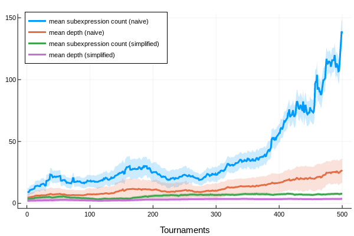

Decompilation and Simplification
================================

In order for our results to be of any use to a subject area expert, we translate the programs that constitute our genetic representations into concise symbolic expressions.

We use a combination of techniques, here.

Decompiling Linear Instruction Code to Symbolic Expression Trees
----------------------------------------------------------------

REFUSR's linear genotypes are composed of a series of primitive register transfer instructions. They resemble assembly code for a simple virtual machine.

~~~{.asm}
TODO: example
~~~

Internally, each instruction is defined as a Julia `struct`, with fields for the source and destination register, the operator (a function), and that operator's arity. (Though we're currently not using any, since they invariably destroy execution information and inhibit evolutionary search, constants can be defined as nullary functions in this fashion, by setting the arity field to zero, and the operator field to `() -> true` or `() -> false`.)

We can translate each instruction to a simple symbolic expression -- indeed, a member of the Julia `Expr` type -- that expresses an assignment. 

~~~{.julia}

function to_expr(inst::Inst)
    op = nameof(inst.op)
    dst = :(R[$(inst.dst)])
    src_t = inst.src < 0 ? :D : :R
    src_i = abs(inst.src)
    src = :($(src_t)[$(src_i)])
    if inst.arity == 2
        :($dst = $op($dst, $src))
    elseif inst.arity == 1
        :($dst = $op($src))
    else # inst.arity == 0
        :($dst = $(inst.op()))
    end
end
~~~

TODO Put some examples here, from the repl.

A sequence of instructions can then be composed into a single assignment expression by performing a series of subexpression replacements, while iterating backwards through the instruction sequence. Whenever we encounter an assignment of the form `lhs := rhs`, we simply replace all occurrences of the subexpression `lhs` with the expression `rhs` in our accumulated expression. 

When the iteration is complete, we are left with a cumulative assignment instruction, which has the output register (`R[1]`) on the left-hand side, and the compound expression, generated through successive replacements, on the right. 

~~~{.julia}
function to_expr(code::Vector{Inst}; incremental_simplify=true)
    DEFAULT_EXPR = false
    code = strip_introns(code, [1])
    if isempty(code)
        return DEFAULT_EXPR
    end
    expr = pop!(code) |> to_expr
    LHS, RHS = expr.args
    while !isempty(code)
        e = pop!(code) |> to_expr
        lhs, rhs = e.args
        RHS = Expressions.replace(RHS, lhs=>rhs)
        if incremental_simplify 
            RHS = Expressions.simplify(RHS)
        end
    end
    # Since we initialize the R registers to `false`, any remaining R references
    # can be replaced with `false`.
    RHS = Expressions.replace(RHS, (e -> e isa Expr && e.args[1] == :R) => false)
    if incremental_simplify
        return Expressions.simplify(RHS)
    else
        return RHS
    end
end
~~~

Simplifying Symbolic Expression Trees
-------------------------------------

### Incremental Simplification

Since the cost of expression simplification grows exponentially (I think? verify!) with the size of the expression, and worst-case expression complexity grows rapidly (quantify this!) with the length of the instruction list, it's better to apply the simplification algorithm after applying each replacement operation in the decompilation algorithm described above than it is to apply it only once to an expression naively decompiled from the entire list.

TODO: plot length of random instruction list against subexpression complexity, plot length of effective code over evolution, show that even when the length is curbed, expression complexity increases with evolutionary progress -- presumably up to a point. where does it plateau? what's the upper bound? 

1.  [TODO]{.todo .TODO} quantify these complexity claims, either
    empirically or, better, theoretically

### Caching

`evoL`, here, is a new, single-island population of 100 genotypes, each with a maximum code length of 100, using 6 immutable input registers, `D[1:6]` and 6 mutable scratch registers, `R[1:6]`. `R[1]` is designated as the output register -- whichever value is held by `R[1]` at the end of execution is taken as the program's return value.

The exact numbers can vary wildly from run to run, even when, as here, we begin with identical initial populations. But the expression complexity of the naively decompiled programs is _consistently_ orders of magnitude greater than what we find in the simplified program, and growing at a tremendously accelerated rate.

And it only gets worse from there, for the naive method of expression decompilation, while our simpification technique appears to consistently suppress expression bloat.

By utilizing a 2-gibibyte cache with the `simplify()` function, we're able to obtain an impressive, 100x speedup when decompiling a virgin, unevolved population.

~~~ {.julia}
julia> Expressions._use_cache(false); Expressions.flush_cache!()
LRU{Expr, Union{Bool, Expr, Symbol}}(; maxsize = 1048576)

julia> @btime s = LinearGenotype.decompile(rand(evoL.geo.deme), cache=false)
908.448 μs (3226 allocations: 281.33 KiB)
true

julia> Expressions._use_cache(true); Expressions.flush_cache!()
LRU{Expr, Union{Bool, Expr, Symbol}}(; maxsize = 1048576)

julia> @btime s = LinearGenotype.decompile(rand(evoL.geo.deme), assign=false)
8.610 μs (57 allocations: 2.39 KiB)
:(D[1])
~~~

Now, naive (unsimplified) expression complexity tends to increase as the population evolve (TODO: plot this!), as more or less coherent logical structure begins to crystalize in the soup of once merely random instructions. This makes the simplification algorithm increasingly costly to run. Indeed, before we implemented incremental simplification in the decompilation algorithm, simplifying genome at a late stage in the evolution would often take upwards of 30 minutes, if it didn't exhaust the memory of our workstation entirely.

Furthermore, since the population evolves through recombinatorial (and
sometimes mutational) means -- even though this is at the level of
linear instructions and not symbolic expressions -- we should expect
common subexpressions to recur quite frequently, which makes a
compelling case for caching.

~~~ {.julia}
julia> @showprogress for i in 1:1000 Step.do_step!(evoL); end
Progress: 100%|██████████████████████████████████████████████████████| Time: 0:00:05

julia> Expressions._use_cache(true); Expressions.flush_cache!()
LRU{Expr, Union{Bool, Expr, Symbol}}(; maxsize = 1048576)

julia> @btime s = LinearGenotype.decompile(rand(evoL.geo.deme), assign=false)
  29.740 μs (200 allocations: 8.66 KiB)
:((D[5] & (D[1] | D[6])) & (D[2] | D[3]))

julia> Expressions._use_cache(false); Expressions.flush_cache!()
LRU{Expr, Union{Bool, Expr, Symbol}}(; maxsize = 1048576)

julia> @btime s = LinearGenotype.decompile(rand(evoL.geo.deme), cache=false)
  109.895 ms (36699 allocations: 3.11 MiB)
:(((D[1] | D[6]) & (D[3] | D[4])) & (D[5] | D[6]))
~~~
